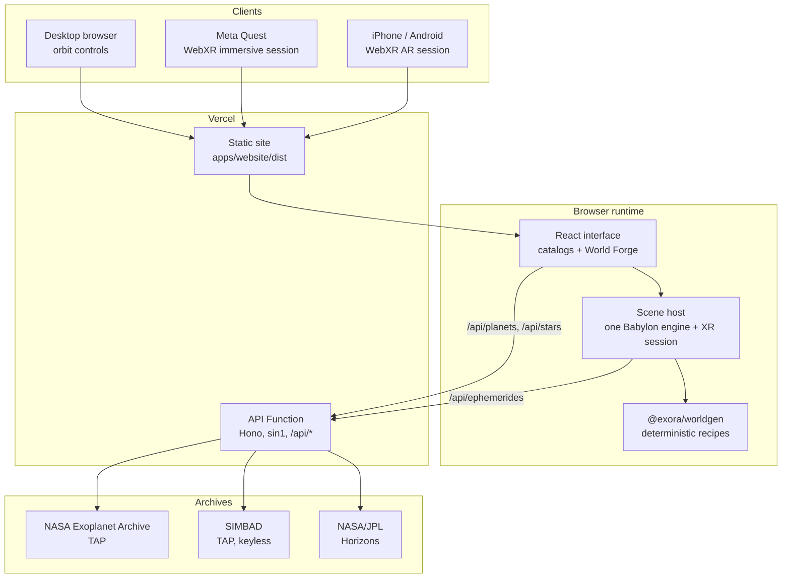

# Exora

## Purpose

Exora turns catalogued astronomy into a place you can stand in. It reads confirmed exoplanets from the NASA Exoplanet Archive and stars from SIMBAD, derives a deterministic visual recipe from each object's measured properties, and renders that recipe as a real-time Babylon.js world you can orbit on a desktop or walk inside a WebXR headset.

Every world is a reading of a catalog row, never observed imagery. Exora keeps the three tiers apart at the type level and in the interface: **measured** values are printed verbatim from the archive, **derived** values come from established physics applied to those measurements, and **inferred** appearance is a cautious probabilistic read carrying its own confidence. A field the catalog never reported stays `null` rather than being backfilled with a plausible number.

The system diorama is where that discipline is most visible, because a picture of a whole system cannot be drawn without compressing it: the orbits are measured, the mapping onto a room is derived, the appearance is inferred, and the view prints the two compressions and the clock rate rather than letting the layout imply it is linear.

## Features

- **Confirmed-planet catalog:** Search, browse, and switch worlds live against the NASA Exoplanet Archive, with twelve curated discovery collections from `earth-like` and `ocean-candidates` through `lava-worlds` and `record-breakers`.
- **System diorama:** A whole host system as a place to stand inside — the star at the centre, every confirmed world on the orbit the archive measured for it, turning at its own measured period. Orbit radii span decades within one host and bodies are four orders of magnitude smaller again, so both scales are compressed logarithmically and the interface prints exactly what it did; an orbit whose shape or plane was never solved for is drawn circular and coplanar and says so, and a world the archive places nowhere is named rather than given an orbit.
- **Stellar catalog:** Resolve stars by exact identifier through SIMBAD's keyless TAP service, with twelve stellar collections spanning nearby stars, solar analogs, blue giants, binaries, variables, and stellar remnants.
- **Deterministic world recipes:** A shared, versioned `worldgen` package maps an object's physical properties to a visual class, palette family, terrain, cloud, and ring recipe. The same catalog row always produces the same world, and `WORLDGEN_VERSION` invalidates persisted recipes when the rules change.
- **Physically motivated renderers:** Procedural gas-giant bands and storms, methane-hazed ice giants with ring systems, and displaced rocky terrain with oceans, ice caps, and lava driven by inferred chemistry.
- **Surface vistas built from geology:** Standing on a world means standing in its landform provinces — crater-saturated highlands, dune seas, canyon systems, lava fields, fractured ice, folded ranges — mixed per world and blended across a patch that runs to a real horizon. For a Solar System body the provinces, palette, crater density, relief and sky are stated from mission science rather than inferred: Io has no impact craters because nothing on it survives long enough to keep one, Venus has almost none, Europa's relief is a fraction of a rocky planet's, and the Moon's sky is black at noon. Sunlight is baked per vertex into the terrain and everything standing on it, so a low sun throws real shadows, and each world is exposed the way a camera would expose for it.
- **One resolved star implementation:** Photosphere with multi-scale convection, a supergranular magnetic network, limb-brightened faculae, deterministic starspots, limb darkening, corona, and glare — shared by the star scene and by every host star hanging in a planet's sky.
- **World Forge:** A two-mode builder for procedural planets and custom stars, seeded and reproducible, using the same recipe engine as the catalog.
- **Persistent immersive session:** The engine, scene, camera, and WebXR session outlive the active destination, so entering and leaving VR does not rebuild the viewing context.
- **iPhone and Android AR:** The same immersive control prefers the established Meta Quest VR session, selects native `immersive-ar` on an AR-only phone, and uses Variant Launch's App Clip handoff on iPhone. AR presents the existing Babylon world at tabletop scale over camera passthrough, with hit-tested placement, drag repositioning, and pinch scaling — no GLB or USDZ export path.
- **Direct Quest shortcuts:** The controller trigger can enter or exit immersive VR when the runtime exposes it. Discover and World Forge remain browser-only; no browser UI is captured or rendered inside VR.
- **Adaptive rendering budget:** Separate desktop, mobile, and Quest profiles govern shader octaves, sphere tessellation, star count, texture detail, and render scale. Immersive sessions raise fixed foveation after three seconds below 62 FPS and relax it again above 70.
- **Desktop WebXR emulation:** An opt-in Immersive Web Emulation Runtime installs a synthetic Quest over `navigator.xr`, so the immersive path runs unmodified in a normal tab.
- **Graceful degradation:** A six-hour planet cache, a twelve-hour star cache, and a bundled local profile keep the experience alive when NASA, SIMBAD, or the API is unreachable.

## Stack

- **Toolchain and monorepo:** Vite+ (`vp`), pnpm workspaces with a version catalog, TypeScript
- **Web:** React 19, Vite, Babylon.js 9 (WebGL2 + WebXR)
- **API:** Hono on Node 24
- **Data sources:** NASA Exoplanet Archive TAP, SIMBAD TAP (CDS, Strasbourg), and NASA/JPL APIs
- **Immersive tooling:** IWER and `@iwer/devui` for desktop WebXR emulation
- **Hosting:** Vercel static output plus a Vercel Function, with Analytics and Speed Insights

## Development

Install the workspace and run the static checks and tests with Vite+:

```sh
vp install
vp check
vp test
```

The website and API are separate workspace applications with their own commands, so they run through Vite Task:

```sh
vp run dev          # website and API together
vp run dev:web      # website only
vp run dev:api      # API only
vp run ready        # check, test, and build every workspace
```

The site serves on <http://localhost:5173> and the API on <http://localhost:8787>:

```text
GET /api/health
GET /api/planets?q=kepler&limit=12
GET /api/planets?category=ocean-candidates&limit=12
GET /api/planets?host=Kepler-297
GET /api/planets/featured
GET /api/planets/:name
GET /api/stars?q=sirius&limit=12
GET /api/stars?category=nearby-stars&limit=12
GET /api/stars/featured
GET /api/stars/:name
```

`vp dev` and `vp build` always invoke Vite's built-in commands. Use `vp run dev` in this repository so both applications start.

### Immersive mode

WebXR requires a secure context. Localhost works for desktop development, but testing from a Quest on the local network needs HTTPS or a deployed origin.

To exercise the immersive VR flow without a headset, open <http://localhost:5173/?xr=emulate>; `?xr=stereo` renders both eyes side by side and `?xr=off` returns to the native runtime. See the [desktop WebXR emulation guide](docs/webxr-emulation.md), use the [Meta Quest smoke-test checklist](docs/quest-testing.md) for headset validation and performance targets, and follow the [iPhone AR deployment and smoke-test guide](docs/iphone-ar.md) for Variant Launch configuration and real-device testing.

## Workspace

```text
apps/api             Hono API with NASA, SIMBAD, and JPL adapters
apps/website         React interface and the Babylon.js scene host
packages/contracts   Shared API, exoplanet, and star types
packages/worldgen    Deterministic data-to-world recipe engine
```

`packages/worldgen` is the only place a catalog row becomes an appearance, so the API and browser renderer describe an object the same way. Texture provenance and licensing for the close-range detail maps are recorded in [THIRD_PARTY_ASSETS.md](THIRD_PARTY_ASSETS.md).

## Current deployment architecture

The website builds to static output served from Vercel's edge, and the Hono application is bundled into a single Vercel Function pinned to `sin1`. A rewrite sends every `/api/*` path to that one function, which keeps routing inside Hono rather than splitting it across per-route handlers.

The function always loads planets from the live NASA Exoplanet Archive. Stars resolve through SIMBAD, which needs no registration or key; Solar System ephemerides resolve through NASA/JPL services.

The upstream adapters wrap their queries in bounded in-memory caches with request timeouts, including six hours for planets and twelve for stars. Responses also carry `Cache-Control` with `stale-while-revalidate` so Vercel's CDN absorbs repeated reads.

The in-process caches and request budgets are intentionally per-instance safeguards, not global
quotas. See [API rate limiting and caching](docs/api-rate-limiting-and-caching.md) for the trust
boundary, shared-cache behavior, operational tradeoffs, and the evidence threshold for adding a
globally enforced control.

The browser holds one Babylon engine for the lifetime of the page. Worlds are built into and removed from that single scene, which is what lets an immersive session survive travel between destinations.


