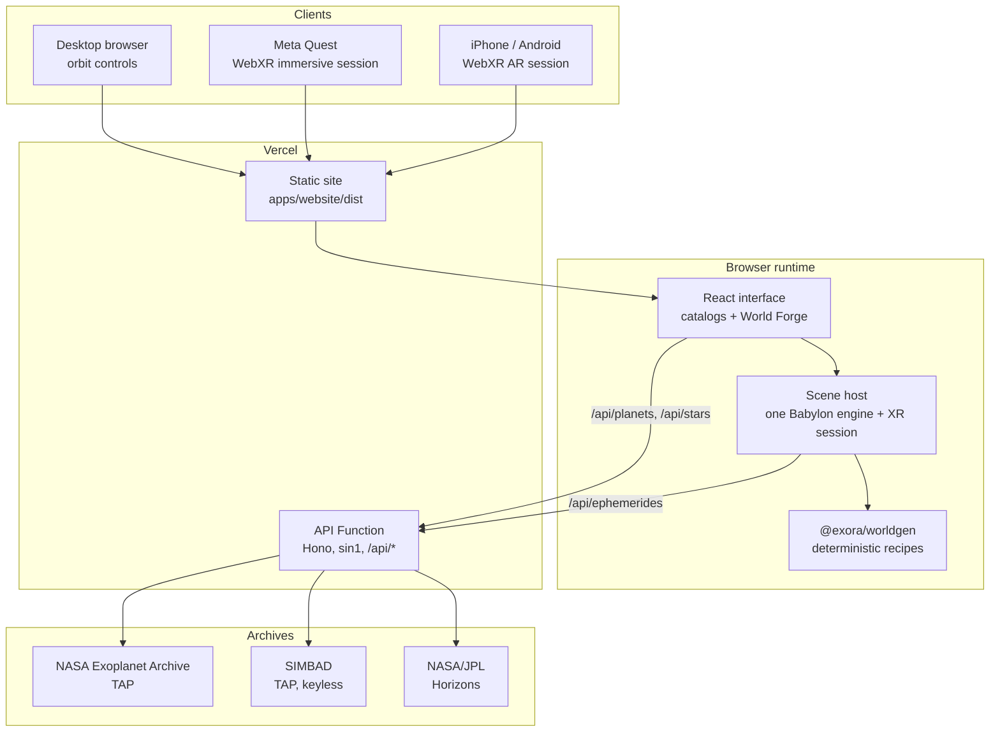

# Exora

## Purpose

Exora turns catalogued astronomy into a place you can stand in. It reads confirmed exoplanets from the NASA Exoplanet Archive and stars from SIMBAD, derives a deterministic visual recipe from each object's measured properties, and renders that recipe as a real-time Babylon.js world you can orbit on a desktop or walk inside a WebXR headset.

Every world is a reading of a catalog row, never observed imagery. Exora keeps the three tiers apart at the type level and in the interface: **measured** values are printed verbatim from the archive, **derived** values come from established physics applied to those measurements, and **inferred** appearance is a cautious probabilistic read carrying its own confidence. A field the catalog never reported stays `null` rather than being backfilled with a plausible number.

The system diorama is where that discipline is most visible, because a picture of a whole system cannot be drawn without compressing it: the orbits are measured, the mapping onto a room is derived, the appearance is inferred, and the view prints the two compressions and the clock rate rather than letting the layout imply it is linear.

## Features

- **Confirmed-planet catalog:** Search, browse, and switch worlds live against the NASA Exoplanet Archive, with twelve curated discovery collections from `earth-like` and `ocean-candidates` through `lava-worlds` and `record-breakers`.
- **System diorama:** A whole host system as a place to stand inside — the star at the centre, every confirmed world on the orbit the archive measured for it, turning at its own measured period. Orbit radii span decades within one host and bodies are four orders of magnitude smaller again, so both scales are compressed logarithmically and the interface prints exactly what it did; an orbit whose shape or plane was never solved for is drawn circular and coplanar and says so, and a world the archive places nowhere is named rather than given an orbit.
- **The signal each world was found in:** A Signal tab reads the transit depth, duration and chord, the star's velocity wobble, reflex orbit and astrometric shift, the odds the orbit transits at all, and the dip one atmospheric scale height would add. It draws them as the limb-darkened light curve and velocity curve an instrument records, with the floor pinned to the archive's measured depth.
- **Next transit:** From the archive's ephemeris, the next crossing in the reader's own time zone, converted from barycentric time to an Earth clock, with an error that grows by the period uncertainty every orbit. A prediction whose error rivals the transit itself is flagged.
- **Composition:** The implied iron-core fraction from Zeng et al. (2016) over the 1–8 Earth-mass range the fit covers, the Earth Similarity Index as the comparison it is, and a mass–radius diagram against the Solar System's planets and the rocky composition curves. Minimum masses carry an arrow and estimated radii are drawn hollow.
- **Exoplanet atlas:** Every confirmed planet on the period–radius and period–mass planes, with the radius valley and the Solar System marked, and discoveries stacked by year and method. Estimated values stay off their axis unless asked for, hovering identifies a world and clicking travels there.
- **Where to look:** The constellation from the IAU boundaries (Roman 1987), the season it crosses the meridian at midnight, the latitudes that never see it rise or set, the instrument its magnitude needs, and how long Voyager 1 would take to get there.
- **Hertzsprung–Russell diagram:** Each star placed from its own measured temperature, magnitude and distance among the naked-eye stars Exora already ships for its sky.
- **Diorama clock and sonification:** Hold, reverse or speed up a system's orbits, and listen to them. Each world plucks a note pitched to its orbital frequency as it crosses Earth's line of sight, so a resonant chain like TRAPPIST-1's is heard as rhythm, and each neighbouring pair's period ratio is named.
- **One interface for every destination, lit by its star:** A world, a star, a black hole, a diorama and a region all use the same layout: actions across the top, the destination's name and the places it leads to at the lower left, and its readings in an inspector on the right. On a phone the name and readings share one bottom sheet that rests at a peek and is dragged, flicked or tapped open. The interface's single accent colour is the blackbody colour of the star lighting the destination, so a red dwarf's world reads warm and Sirius reads cold.
- **Go anywhere:** The search field in the top bar, ⌘K, Ctrl+K or `/` opens a palette ranking every bundled world, moon, region, black hole and tour instantly, with planets, host systems and stars from the archives merged in as you type. Planet search matches names whatever separates their parts.
- **Guided tours:** Narrated journeys through real destinations, each step an ordinary shareable URL, started from Explore or the palette.
- **Offline:** A service worker keeps the shell, hashed assets, textures and sky catalogue after the first visit, and serves the last good archive answer only when the network fails.
- **Stellar catalog:** Resolve stars by exact identifier through SIMBAD's keyless TAP service, with twelve stellar collections spanning nearby stars, solar analogs, blue giants, binaries, variables, and stellar remnants.
- **Deterministic world recipes:** A shared, versioned `worldgen` package maps an object's physical properties to a visual class, palette family, terrain, cloud, and ring recipe. The same catalog row always produces the same world, and `WORLDGEN_VERSION` invalidates persisted recipes when the rules change.
- **Physically motivated renderers:** Procedural gas-giant bands and storms, methane-hazed ice giants with ring systems, and displaced rocky terrain with oceans, ice caps, and lava driven by inferred chemistry.
- **Surface vistas built from geology:** Standing on a world means standing in its landform provinces — crater-saturated highlands, dune seas, canyon systems, lava fields, fractured ice, folded ranges — mixed per world and blended across a patch that runs to a real horizon. For a Solar System body the provinces, palette, crater density, relief and sky are stated from mission science rather than inferred: Io has no impact craters because nothing on it survives long enough to keep one, Venus has almost none, Europa's relief is a fraction of a rocky planet's, and the Moon's sky is black at noon. Sunlight is baked per vertex into the terrain and everything standing on it, so a low sun throws real shadows, and each world is exposed the way a camera would expose for it.
- **One resolved star implementation:** Photosphere with multi-scale convection, a supergranular magnetic network, limb-brightened faculae, deterministic starspots, limb darkening, corona, and glare — shared by the star scene and by every host star hanging in a planet's sky.
- **World Forge:** A seeded, reproducible builder for procedural planets, custom stars, and black holes, using the same recipe engines as the catalogs.
- **Persistent immersive session:** The engine, scene, camera, and WebXR session outlive the active destination, so entering and leaving VR does not rebuild the viewing context.
- **iPhone and Android AR:** The same immersive control prefers the established Meta Quest VR session, selects native `immersive-ar` on an AR-only phone, and uses Variant Launch's App Clip handoff on iPhone. AR presents the existing Babylon world at tabletop scale over camera passthrough, with hit-tested placement, drag repositioning, and pinch scaling — no GLB or USDZ export path.
- **Direct Quest shortcuts:** The controller trigger can enter or exit immersive VR when the runtime exposes it. Explore and World Forge remain browser-only; no browser UI is captured or rendered inside VR.
- **Adaptive rendering budget:** Separate desktop, mobile, and Quest profiles govern shader octaves, sphere tessellation, star count, texture detail, and render scale. Immersive sessions raise fixed foveation after three seconds below 62 FPS and relax it again above 70.
- **Desktop WebXR emulation:** An opt-in Immersive Web Emulation Runtime installs a synthetic Quest over `navigator.xr`, so the immersive path runs unmodified in a normal tab.
- **Graceful degradation:** A six-hour planet cache, a twelve-hour star cache, and a bundled local profile keep the experience alive when NASA, SIMBAD, or the API is unreachable.

## Keyboard

| Key                   | Does                                           |
| --------------------- | ---------------------------------------------- |
| ⌘K, Ctrl+K or `/`     | Go anywhere by name                            |
| Backspace             | Open or close Explore                          |
| H                     | Hide or show the interface                     |
| Esc                   | Close whatever is open                         |
| Drag, scroll, W A S D | Orbit, zoom or land, and walk on a surface     |
| Tab                   | Move between controls; it is never intercepted |

## Stack

- **Toolchain and monorepo:** Vite+ (`vp`), pnpm workspaces with a version catalog, TypeScript
- **Web:** React 19, Vite, Babylon.js 9 (WebGL2 + WebXR)
- **API:** Hono on Node 24
- **Data sources:** NASA Exoplanet Archive TAP, SIMBAD TAP (CDS, Strasbourg), and NASA/JPL APIs
- **Immersive tooling:** IWER and `@iwer/devui` for desktop WebXR emulation
- **Hosting:** Vercel static output plus a Vercel Function, with Analytics and Speed Insights

## Development

Install the workspace and run the static checks and tests with Vite+:

```sh
vp install
vp check
vp test
```

The website and API are separate workspace applications with their own commands, so they run through Vite Task:

```sh
vp run dev          # website and API together
vp run dev:web      # website only
vp run dev:api      # API only
vp run ready        # check, test, and build every workspace
```

Pull requests and pushes to `main` run formatting, linting, type checking, unit tests, asset
provenance checks, production builds (including the JavaScript performance budget), production
dependency auditing, and the desktop Chromium journey smoke suite. Install Chromium once, then run
the browser suites locally with:

```sh
vp exec --filter website -- playwright install chromium
vp run website#test:browser:desktop
vp run website#test:browser:full
```

The full command adds the mobile Chromium configuration. Nightly and manual GitHub Actions runs also
execute both Lighthouse profiles. See [Performance quality gates](docs/performance-quality.md) for
the local Lighthouse command and manual workflow instructions.

The site serves on <http://localhost:5173> and the API on <http://localhost:8787>:

```text
GET /api/health
GET /api/planets?q=kepler&limit=12
GET /api/planets?category=ocean-candidates&limit=12
GET /api/planets?host=GJ%20674
GET /api/planets/featured
GET /api/planets/population
GET /api/planets/:name
GET /api/stars?q=sirius&limit=12
GET /api/stars?category=nearby-stars&limit=12
GET /api/stars/featured
GET /api/stars/:name
```

`vp dev` and `vp build` always invoke Vite's built-in commands. Use `vp run dev` in this repository so both applications start.

Local development uses the website's Vite server and its `/api` proxy rather than Vercel CLI
emulation. The API deployment bundle is produced and validated by its workspace build:

```sh
vp run @exora/api#build
```

### Immersive mode

WebXR requires a secure context. Localhost works for desktop development, but testing from a Quest on the local network needs HTTPS or a deployed origin.

To exercise the immersive VR flow without a headset, open <http://localhost:5173/?xr=emulate>; `?xr=stereo` renders both eyes side by side and `?xr=off` returns to the native runtime. See the [desktop WebXR emulation guide](docs/webxr-emulation.md), use the [Meta Quest smoke-test checklist](docs/quest-testing.md) for headset validation and performance targets, and follow the [iPhone AR deployment and smoke-test guide](docs/iphone-ar.md) for Variant Launch configuration and real-device testing.

## Workspace

```text
apps/api             Hono API with NASA, SIMBAD, and JPL adapters
apps/website         React interface and the Babylon.js scene host
packages/contracts   Shared API, exoplanet, and star types
packages/worldgen    Deterministic data-to-world recipe engine
```

Inside `apps/website/src`, the interface is built from a small set of parts:

```text
styles/tokens.css          Colour, type scale, spacing, radii and motion; nothing else defines them
star-light.ts              The local star's light, which every destination sets as the accent
readable.ts                Sentence case for readings still produced in capitals
components/ui              Button, Icon, TabBar, Segmented, Kbd, Spinner
components/shell           The chrome every destination shares: top bar, sheet, loading, hints
components/catalog         Search, collection rail and result cards shared by every catalog
```

A destination describes itself to `DestinationShell` through an identity and a `DestinationPanelModel`
and never lays out chrome of its own; Explore's catalogs are assembled from `components/catalog`.

`packages/worldgen` is the only place a catalog row becomes an appearance, so the API and browser renderer describe an object the same way. Texture provenance and licensing for the close-range detail maps are recorded in [THIRD_PARTY_ASSETS.md](THIRD_PARTY_ASSETS.md).

## Current deployment architecture

Vercel's Git integration is the supported deployment workflow. Push a branch or open a pull
request to create a Preview deployment, and merge to `main` to create the Production deployment.
Vercel reads the committed `vercel.json`, which keeps the website and API build, function bundle,
region, rewrites, and response headers under version control.

The repository does not install Vercel CLI. If a deployment must be started manually, use the
latest CLI as a one-off command instead of adding it to the workspace:

```sh
pnpm dlx vercel@latest         # Preview
pnpm dlx vercel@latest --prod  # Production
```

The website builds to static output served from Vercel's edge, and the Hono application is bundled into a single Vercel Function pinned to `sin1`. A rewrite sends every `/api/*` path to that one function, which keeps routing inside Hono rather than splitting it across per-route handlers.

The function always loads planets from the live NASA Exoplanet Archive. Stars resolve through SIMBAD, which needs no registration or key; Solar System ephemerides resolve through NASA/JPL services.

The upstream adapters wrap their queries in bounded in-memory caches with request timeouts, including six hours for planets and twelve for stars. Responses also carry `Cache-Control` with `stale-while-revalidate` so Vercel's CDN absorbs repeated reads.

The in-process caches and request budgets are intentionally per-instance safeguards, not global
quotas. See [API rate limiting and caching](docs/api-rate-limiting-and-caching.md) for the trust
boundary, shared-cache behavior, operational tradeoffs, and the evidence threshold for adding a
globally enforced control.

The browser holds one Babylon engine for the lifetime of the page. Worlds are built into and removed from that single scene, which is what lets an immersive session survive travel between destinations.


```mermaid
flowchart TB
    subgraph Clients
        Desktop["Desktop browser<br/>orbit controls"]
        Headset["Meta Quest<br/>WebXR immersive session"]
        Phone["iPhone / Android<br/>WebXR AR session"]
    end

    subgraph Browser["Browser runtime"]
        UI["React interface<br/>catalogs + World Forge"]
        Host["Scene host<br/>one Babylon engine + XR session"]
        Worldgen["@exora/worldgen<br/>deterministic recipes"]
    end

    subgraph Vercel["Vercel"]
        Static["Static site<br/>apps/website/dist"]
        Fn["API Function<br/>Hono, sin1, /api/*"]
    end

    subgraph Archives["Archives"]
        NASA["NASA Exoplanet Archive<br/>TAP"]
        SIMBAD["SIMBAD<br/>TAP, keyless"]
        JPL["NASA/JPL<br/>Horizons"]
    end

    Desktop --> Static
    Headset --> Static
    Phone --> Static
    Static --> UI
    UI --> Host
    Host --> Worldgen

    UI -->|/api/planets, /api/stars| Fn
    Host -->|/api/ephemerides| Fn

    Fn --> NASA
    Fn --> SIMBAD
    Fn --> JPL
```
